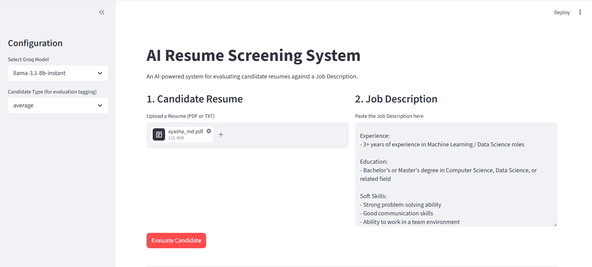

# 📝 AI Resume Screening System with LangSmith Tracing

An AI-powered Resume Screening System that evaluates candidates against a job description using LLMs, LangChain (LCEL), and LangSmith for tracing and debugging.



---

## 🚀 Project Overview

This project simulates a real-world recruiter tool that:

- Parses resumes (PDF/TXT)
- Extracts **skills, tools, and experience**
- Matches candidates with a job description
- Assigns a **fit score (0–100)**
- Provides **clear, explainable reasoning**
- Tracks the full pipeline using **LangSmith tracing**

---

## 🧠 Pipeline Architecture

```text
Resume Input
↓
📄 Resume Parsing
↓
🧠 Skill Extraction (LLM)
↓
⚖️ Matching + Evaluation
↓
📊 Scoring (0–100)
↓
📝 Explanation
↓
🔍 LangSmith Tracing
```

---

## ⚙️ Tech Stack

- **Python**
- **LangChain (LCEL - modern API)**
- **Groq LLM (LLaMA / Mixtral)**
- **Streamlit (UI)**
- **LangSmith (Tracing & Debugging)**
- **Pydantic (Structured Output)**

---

## 📁 Project Structure

```text

resume_screening/
│
├── app.py # Streamlit UI
├── config.py # Configurations
├── .env # API keys
│
├── chains/
│ ├── extraction_chain.py
│ └── scoring_chain.py
│
├── prompts/
│ ├── extraction_prompt.py
│ └── scoring_prompt.py
│
├── utils/
│ └── resume_parser.py
│
└── data/ # Sample resumes & job descriptions

```

---

## 🔑 Features

### ✅ Skill Extraction

- Extracts:
  - Skills
  - Tools
  - Experience
- Uses structured output (Pydantic)
- Strict: **No hallucination**

---

### ✅ Candidate Evaluation

- Compares resume with job description
- Identifies:
  - Strengths
  - Gaps
- Assigns **fit score (0–100)**

---

### ✅ Explainable AI

- Provides:
  - Why the score was assigned
  - Strengths
  - Weaknesses

---

### ✅ LangSmith Tracing (Key Feature)

- Tracks entire pipeline:
  - Extraction
  - Scoring
- Includes:
  - Run names
  - Tags (strong / average / weak)
- Helps debug:
  - Wrong extraction
  - Incorrect scoring

---

## 🔍 LangSmith Setup

Add this to your `.env`:

```text

LANGCHAIN_TRACING_V2=true
LANGCHAIN_API_KEY=your_langsmith_api_key
LANGCHAIN_PROJECT=AI_resume_screening_system

```

---

### 🧪 What gets traced?

Each run shows:

- Input (resume + JD)
- Extracted skills
- LLM responses
- Final score
- Explanation

---

### 🏷️ Tags Used

- `strong`
- `average`
- `weak`
- `extraction`
- `evaluation`

---

## 🖥️ How to Run

### 1. Clone repo

### 2. Install dependencies

```text
pip install -r requirements.txt
```

### 3. Setup environment variables

Create .env:

```text

GROQ_API_KEY=your_groq_key
LANGCHAIN_TRACING_V2=true
LANGCHAIN_API_KEY=your_langsmith_key
LANGCHAIN_PROJECT=AI_resume_screening_system

```

### 4. Run app

```text

streamlit run app.py

```

---

### 📥 Inputs

- Resume (PDF or TXT)
- Job Description (text)

### 📤 Outputs

Extracted skills, tools, experience
Fit Score (0–100)
Explanation of evaluation

### 🧪 Example Results

#### 🟢 Strong Candidate

Score: 85–95
Strong skill alignment
Relevant experience

#### 🟡 Average Candidate

Score: 50–75
Partial skill match
Some missing tools

#### 🔴 Weak Candidate

Score: 0–40
Major skill gaps
Irrelevant experience

---

### 🤝 Acknowledgements

- LangChain
- Groq API
- LangSmith

### 📌 Author

_Ayasha Mohammad_
_AI/ML Enthusiast | GenAI Developer_

**GitHub**: https://github.com/YOUR_USERNAME
